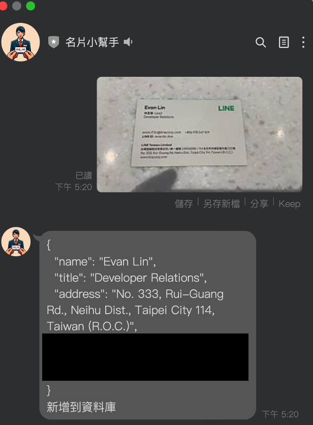
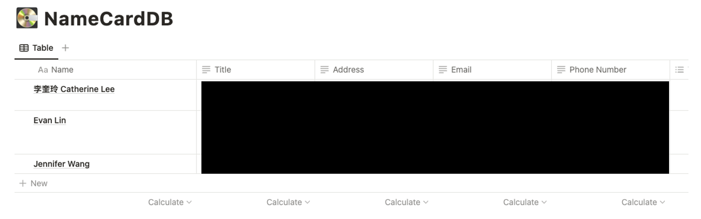

LINE Bot 使用 Google Gemini Pro 來做的名片小幫手

---

     

### LINE Bot Screen

### Notion DB image

## 如何快速架設在自己平台

請根據以下的流程，來直接透過開源的程式碼來架設一個 LINEBot 跟 GCP  STT 與 GCS (Google Cloud Storage) 的結合。

### 事前準備

- [LINE Developers 帳號](https://developers.line.biz/console/)
  - 到 [LINE Developers Console](https://developers.line.biz/console/) 透過你的 LINE 帳號登入。
  - 開啟 LINE Developers 帳號
  - 開啟一個官方帳號 Message API Channel 並且取得 `channel secret` 與 `channel access token`。 請[參考這篇教學](https://developers.line.biz/en/docs/messaging-api/getting-started/#using-console)。
- 需要一個免費的 [Heroku](https://dashboard.heroku.com/) 帳號。
- 需要一個收費的 [Google Cloud Platform](https://cloud.google.com/) 帳號，並且取得 GCP JSON key file ，更多詳細流程請參考 [Cloud Storage client libraries](https://cloud.google.com/storage/docs/reference/libraries)。

### 開始部署

1. 請先到程式碼:  [https://github.com/kkdai/linebot-gemini-pro]( https://github.com/kkdai/linebot-gemini-pro)

2. 部署到雲服務平台：

   2.1.  按下：   來部署到你的 Heroku 帳號

3. 除了填寫 App Name 以外，以下的參數必須要填入才能完整運行。

   1. **ChannelAccessToken**: 請到 LINE Developers Console issue 一個。
   2. **ChannelSecret**: 請到 LINE Developers Console 拿一個。
   3. **GOOGLE_GEMINI_API_KEY**: 必需要透過 [Google Gemini API Keys](https://makersuite.google.com/app/apikey) 來取得。
4. 請到 LINE 官方帳號的平台，到了右上角的「設定」中，選擇「帳號設定」
   1. 將你官方帳號基本資料設定好，並且打開加入群組功能。
      1. 

   2. 到回應設定，將以下設定改好：
      1. 回應模式改成「聊天機器人」
      2. 停用「自動回應訊息」
      3. 啟用「Webhook」
   3. 到 Messaging API 選項，將 Webhook 網址填入`: https://{YOUR_HEROKU_SERVER_ID}.herokuapp.com/callback
   4. 關於如何快速部署的流程，可以參考另外一篇文章內的影片：
     - [How to deploy LINE BotTemplate](https://www.youtube.com/watch?v=0BIknEz1f8k)
     - [Hoe to modify your LINE BotTemplate code](https://www.youtube.com/watch?v=ckij73sIRik)

### 如何使用

- **傳送名片照片：** 會自動透過 Gemini Pro 辨識之後，將結果上傳到 Notion DB.

### 完整開發教學

- [[Golang\] 透過 Google Gemini Pro 來打造一個基本功能 LLM LINE Bot](https://www.evanlin.com/til-gogle-gemini-pro-linebot/)

License
---------------

Licensed under the Apache License, Version 2.0 (the "License");
you may not use this file except in compliance with the License.
You may obtain a copy of the License at

<http://www.apache.org/licenses/LICENSE-2.0>

Unless required by applicable law or agreed to in writing, software
distributed under the License is distributed on an "AS IS" BASIS,
WITHOUT WARRANTIES OR CONDITIONS OF ANY KIND, either express or implied.
See the License for the specific language governing permissions and
limitations under the License.
